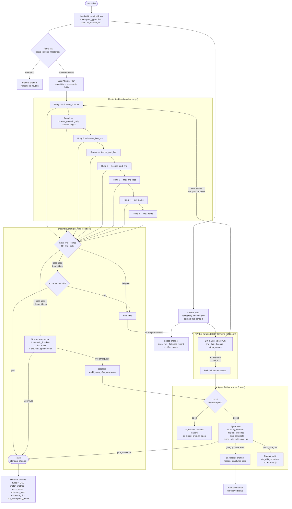

# PSV Orchestration Flow



---

## Output Channels

| Channel | Format | Contents |
|---|---|---|
| `Output/standard/{YYYY-MM}/` | Excel + CSV | Every row — canonical answer, provenance columns |
| `Output/nppes/{YYYY-MM}/` | CSV | Every row — NPPES record + diff vs master |
| `Output/ai_fallback/{YYYY-MM}/` | CSV | Rows that hit the agent — outcome + structured reason |
| `Output/manual/{YYYY-MM}/` | CSV | Unresolved rows — structured failure_reason |
| `Output/_drift/` | CSV (append) | Site drift reports filed by agent |

---

## Structured Failure Reasons

| Code | Trigger |
|---|---|
| `no_routing` | No board for `(state, prov_type)` in routing CSV |
| `no_records` | Every rung on every board returned zero records |
| `name_mismatch` | Records found but no candidate passed the name gate |
| `license_mismatch` | Name matched but license number disagreed |
| `provider_type_mismatch` | Name + license matched but prov_type misaligned |
| `ambiguous_after_narrowing` | Multiple candidates survived all narrowing steps |
| `ai_circuit_breaker_open` | AI endpoint repeatedly errored — skipped |
| `ai_max_turns_exceeded` | Agent ran 8 turns without committing |
| `ai_gave_up` | Agent called `give_up` — reason appended |

---

## Per-Rung Evidence

Every ladder rung captures a screenshot + HTML under:

```
Evidence/{YYYY-MM}/{state}/{source_id}/{ts}_{query}/
  search_results.html
  search_results.png
```

Signature dedup `(source_id, mode, normalized_query)` ensures no rung runs twice,
even when the NPPES retry loop re-enters the master ladder with new field values.
